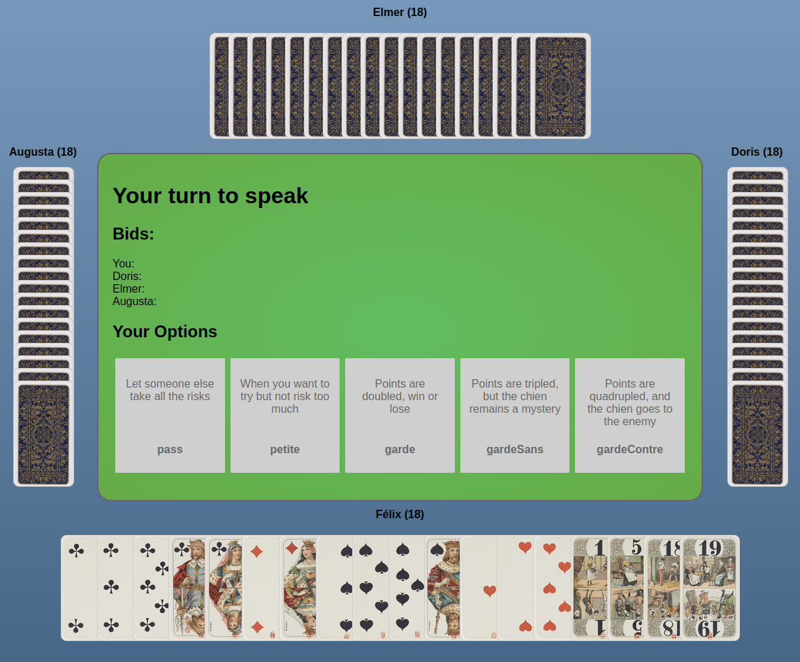

# Tarot

This is an online multiplayer version of the card game Tarot.

Rules in english for the game can be found [here](https://www.pagat.com/tarot/frtarot.html) until a tutorial is added to the game.

## Installation & Build

* Clone the project
* run `yarn`
* in 2 different console windows, run `yarn run server` and `yarn run client`

## Features

## To do List

### AI player difficulties

* [ ] AI development sandbox
* [ ] AI player info collection model
* [ ] dumb AI player
* [ ] less dumb AI player

### Later
* [ ] Advanced room creation & roster management
* [ ] Tarot à cinq
* [ ] tutorial
* [ ] scoreboard
* [ ] player portraits

### Maybe someday
* [ ] i18n
* [ ] themed cards
* [ ] italian suits
* [ ] french suits
* [ ] goblin suits
